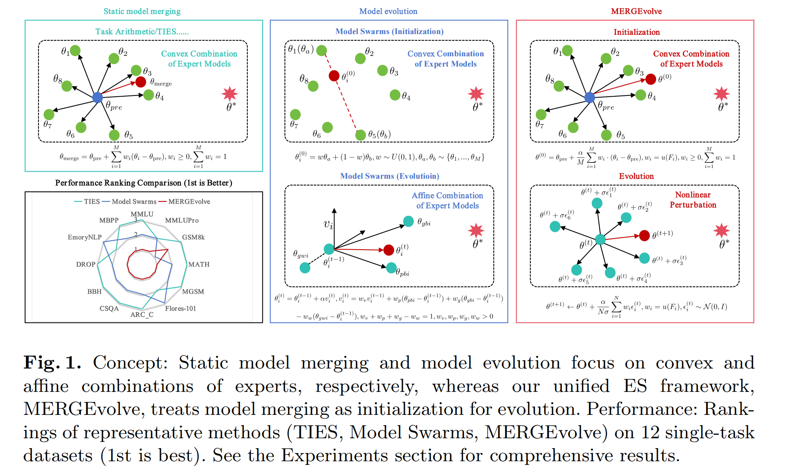

# Model Merging to Evolution: Parameter Space Exploration for Expert Models

<p align="center">
  <a href="#-overview">Overview</a> •
  <a href="#-installation">Installation</a> •
  <a href="#-quick-start">Quick Start</a> •
  <a href="#-supported-benchmarks">Benchmarks</a> •
  <a href="#-project-structure">Structure</a> •
  <a href="#-citation">Citation</a>
</p>

<p align="center">
  
  
  
  
</p>

> Official implementation of **MERGEvolve**, a gradient-free framework that discovers
> high-performing merges of candidate LoRA experts purely from downstream task
> feedback—no back-propagation, no training data labels for the search, and no access
> to the base model's gradients.

---

## 🧩 Overview



## ⚙️ Installation

```bash
# Python 3.10+ recommended
conda create -n mergevolve python=3.10 -y
conda activate mergevolve

pip install -r requirements.txt
```

> **Note on vLLM.** `requirements.txt` pins `vllm==0.7.1+cu118` (CUDA 11.8). Replace it with
> the wheel matching your CUDA toolkit if needed. Runtime LoRA swapping requires the
> environment variable `VLLM_ALLOW_RUNTIME_LORA_UPDATING=True` (handled automatically by
> `deploy_vllm.py`).

## 📁 Data & Model Layout

The code is intended to be run from a project root that contains both the source package
(`src/`) and the benchmark data (`datas/`). Each evaluator reads from `datas/<benchmark>/`
(e.g. `datas/mmlu/`, `datas/gsm8k/`). Inside each benchmark directory the loaders expect
the relevant `valid` / `test` splits.

```
project_root/
├── src/                      # this repository (the importable `src` package)
├── datas/                    # benchmark datasets, one sub-dir per task
│   ├── mmlu/
│   ├── gsm8k/
│   └── ...
└── experts/                  # candidate LoRA experts, one sub-dir per expert
    ├── expert_code/
    │   └── adapter_model.safetensors
    ├── expert_math/
    └── ...
```

Each expert sub-directory must contain a PEFT-style `adapter_model.safetensors` (plus the
`adapter_config.json` used as the LoRA template).

## 🚀 Quick Start

### 1. Launch vLLM inference servers

Start one or more vLLM OpenAI-compatible servers (one per GPU). They expose the endpoints
that the optimizer queries during evaluation.

```bash
python -m src.deploy_vllm \
    --model_name_or_path /path/to/base_model \
    --max_workers 4 \
    --gpu_ids 0 1 2 3
```

The script prints the ports it bound to; pass these to the search via `--ports`.

### 2. Run the MERGEvolve search

```bash
python -m src.run_mergevole \
    --model_path   /path/to/base_model \
    --lora_dir     ./experts \
    --tasks        mmlu gsm8k \
    --test_tasks   mmlu gsm8k \
    --task_weights 1.0 1.0 \
    --update_mode  es \
    --ports        9113 9114 9115 9116 \
    --iters        50 \
    --num_selected_experts 10 \
    --combine_method ties \
    --seed 42
```

Results, the best merged adapter, the run configuration, and per-step state are saved
under `mergevole_workspace/<tasks>/<...>/<run-id>/`.

### Key Arguments

| Argument | Description | Default |
|---|---|---|
| `--model_path` | Path to the base model. | *(required)* |
| `--lora_dir` | Directory of candidate expert LoRAs (one sub-dir each). | *(required)* |
| `--tasks` | Validation tasks driving the search. | *(required)* |
| `--test_tasks` | Held-out tasks for final evaluation. | *(required)* |
| `--task_weights` | Per-task weights (auto-normalized to sum to 1). | uniform |
| `--update_mode` | Optimizer: `es` or `pso`. | `es` |
| `--iters` | Number of search iterations. | `50` |
| `--num_selected_experts` | Experts sampled to initialize `θ`. | `10` |
| `--combine_method` | Weight combination: `ties` / `linear` / `magnitude`. | `ties` |
| `--ports` | vLLM service ports used for parallel evaluation. | `9113…9116` |
| `--early_stop` / `--early_stop_iter` | Enable patience-based early stopping. | off / `5` |

**ES-specific:** `--alpha` (learning rate), `--sigma` (noise std), `--n_samples`
(perturbations/step), `--tau` (utility temperature; try `0.1` for 7B models).

**PSO-specific:** `--phi_inertia`, `--phi_cognitive`, `--phi_social`, `--phi_repel`,
`--phi_lambda`, `--lambda_step`, `--unable_random`.

## 📊 Supported Benchmarks

| Domain | Tasks (`--tasks` value) |
|---|---|
| Knowledge / Reasoning | `mmlu`, `mmlupro`, `mmluproreasoning`, `mmluproknowledge`, `arc_c`, `csqa`, `bbh` |
| Math | `gsm8k`, `math`, `mgsm` |
| Code | `mbpp` |
| Reading Comprehension | `drop` |
| Multilingual Translation | `flores101`, `flores37` |
| Emotion Recognition | `meld`, `emorynlp` |

New benchmarks can be added by implementing an `Evaluator` subclass (see
`src/evaluate/`) and registering it in `src/evaluate/factory.py`.

## 🗂️ Project Structure

```
src/
├── run_mergevole.py          # CLI entry point for the search
├── deploy_vllm.py            # spins up vLLM servers + runtime LoRA (un)loading
├── utils.py                  # LoRA I/O, prompt templates, URL helpers
├── requirements.txt
├── base/                     # framework abstractions
│   ├── base_method.py        # search loop, evaluation orchestration, state I/O
│   ├── base_individual.py    # fitness evaluation & adapter persistence
│   └── base_config.py        # config dataclass + validation
├── mergevole/                # the MERGEvolve optimizer
│   ├── mergevole.py          # ES/PSO search, utility weighting, θ updates
│   ├── particle.py           # PSO particle (velocity/position updates)
│   └── config.py             # PSOConfig hyper-parameters
└── evaluate/                 # benchmark evaluators
    ├── eval.py / factory.py  # evaluator base classes & registry
    └── <BENCHMARK>/          # one package per benchmark
```

## 📝 Citation

If you find this work useful, please cite:

```bibtex
@inproceedings{mergevolve,
  title     = {MERGEvolve: Training-Free LoRA Expert Merging via Swarm and Evolutionary Search},
  author    = {Anonymous},
  booktitle = {Under Review},
  year      = {2026}
}
```

## 📄 License

Released under the MIT License. See `LICENSE` for details.

## 🙏 Acknowledgements

This project builds on [vLLM](https://github.com/vllm-project/vllm),
[PEFT](https://github.com/huggingface/peft), and the Hugging Face ecosystem, and draws
inspiration from prior work on model merging and population-based optimization.
